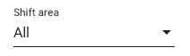
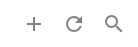
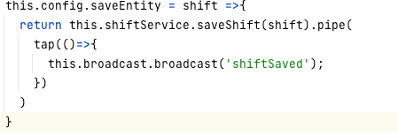

#Setting up locally

Pre-requisite
``The application works on Java 11 only!!!``

1. Build the jar file by running the following command
   ``mvn clean install -DskipTests=true``
   alternatively, you can run the following too if you get some licence check errors
   ``mvn clean install -DskipTests=true -Dlicense.skip=true``

If you run into PKIX certificate issue, you can by pass it by running the following command;
   ``-Dmaven.wagon.http.ssl.insecure=true -Dmaven.wagon.http.ssl.allowall=true``

2. Start PG database server locally
   ``docker run -d --name tb-pg -e POSTGRES_PASSWORD=postgres -e PGDATA=/var/lib/postgresql/data/pgdata -v ${CUSTOM_MOUNT}:/var/lib/postgresql/data -p 6432:5432 postgres``

3. Create database called "thingsboard"

4. Setup base tables
   ``cd ${TB_WORK_DIR}/application/target/bin/install
   chmod +x install_dev_db.sh
   ./install_dev_db.sh``
   ``sudo ./install_dev_db.sh``

5. Bring up the Thingsboard Application by running the following command:
   ``java -jar application/target/thingsboard-${VERSION}-boot.jar
   ``

6. Access by visiting http://localhost:8080

# Hot Deploy for testing UI changes
``cd ui-ngx``
``mvn clean install -P yarn-start``

# Building Image for Deployment

# Deploying in Production

# WebSocket support (nginx 1.4)
When deploying the application behind Nginx, some services are failing. Add this to the nginx.conf file.

        proxy_http_version 1.1;
        proxy_set_header Upgrade $http_upgrade;
        proxy_set_header Connection "upgrade";

#Entities and their significance
https://thingsboard.io/docs/user-guide/entities-and-relations/

#1. Creating Shift Management Screen

## Menu & Routing

Adding a menu item
1. Add an entry to the menu.service.file
2. shift.module.ts & shift-routing.module.ts - This to manage routing of the shift screen
when the "shift menu" action is called.
   
## Table Header Component
1. Drop Down functionality -  - This is a dynmaic componnet that is used accorss all other screens
such as Assets, Devices etc..
   
         a. update entity-subtype-select.component.ts to provide shift area information.

## Table Header Action

   1. Add action - Create shift-table-config.resolver.ts file and following code is the action
      
      
   2. Form code in shift.component.ts 

## Table
   1. shift-routing.module.ts - import shift-table-config.resolver.ts
   2. All table definitions are in shift-table-config.resolver.ts

## Name Mappings for Keys used in the screens
   1. Names and description of fields etc - local.constant-en_us.json

## Updating Thingsboard base class files

